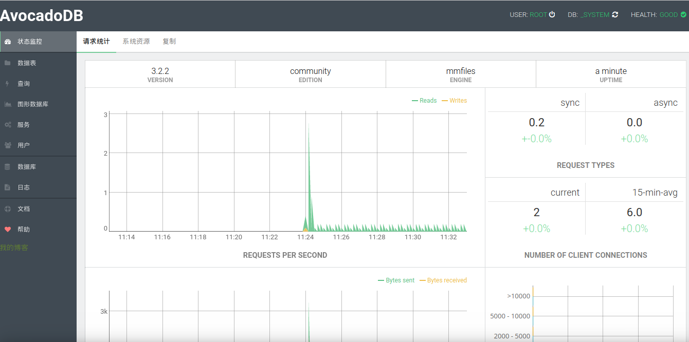
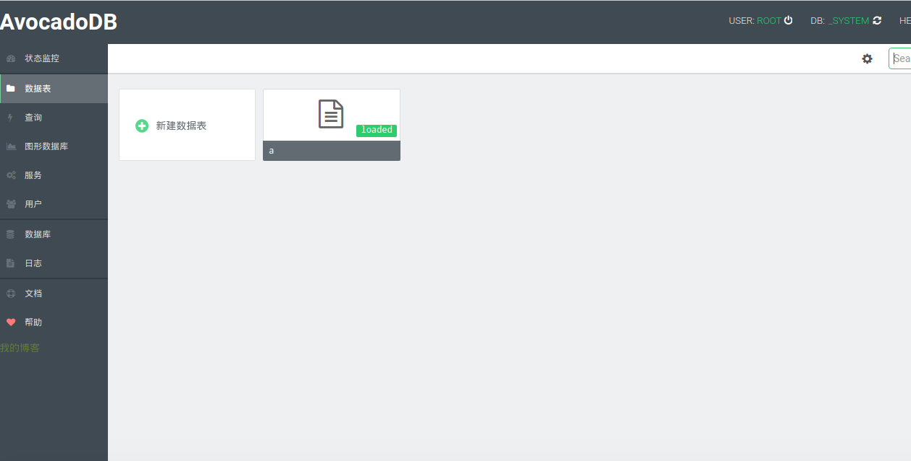

AvocadoDB
========


avocadodb是具有灵活的数据模型的开源本地化数据库

原生支持restful-api。

支持 文档、图表和k/v多结构。

使用Aql构建高性能应用程序。

sql查询语言简单方便。

可使用JavaScript扩展。


AvocadoDB的主要特点
------------------------

- **多模型**: 文档,图形，k/v  多种数据模型由你选择

- **AQL**:灵活方便的AQL查询

  **restful-api** :方便各种前后端直接调用

  **中文化的web管理界面**:不在迷茫！开箱即用！







#   下载最新的编译包

[点击下载](https://github.com/avocadodb/avocadodb/releases)

#   驱动　　　

[驱动](https://www.arangodb.com/arangodb-drivers/)

#    文档

[AQL中文文档](Documentation/AQL.md)
[配置集群](http://freeidea.win/wen/nosql/avocadoc.html)

#   编译方法

```
git clone  https://github.com/avocadodb/avocadodb

mkdir -p build

 cd build

 cmake .. -DCMAKE_BUILD_TYPE=Release

 make

如果想生成安装包  就　　make package

如果安装本机　　sudo make install
或者生成安装包后本地安装

```

#  驱动

完全兼容arangodb


- 致谢[arangodb](https://github.com/arangodb/arangodb)
- 开源软件 **open source** (Apache License 2.0)
